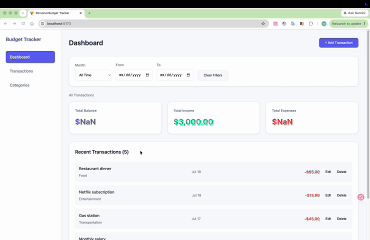

# WalletWatch

CodePath WEB103 Final Project

Designed and developed by: Mario Trevino, Faisal Rasheed Khan, Ke Zhang, Eric Chen, Klane Fondo, Kubra Sag

🔗 Link to deployed app: Pending

### Description and Purpose
WalletWatch is a full-stack budget tracking application that helps users log, categorize, and manage their personal income and expenses. Users can add transactions, tag them with custom categories, and get a clear picture of their spending habits. The app aims to make everyday budgeting simple and approachable, removing the friction of manually organizing finances in spreadsheets.

### Inspiration
Our team was inspired by the everyday challenge of tracking personal spending. Many budgeting tools are either too complex or too rigid, so we wanted to build something lightweight that lets users log transactions quickly and organize them in a way that makes sense to them, without a steep learning curve.

## Tech Stack

Frontend: React

Backend: Node.js, Express

## Features

- [x] ✅ **View Transactions** — Users can view a list of all their income and expense transactions.
  
- [x] ✅ **Add Transaction** — Users can add a new transaction with an amount, description, date, and category.
  
- [x] ✅ **Edit Transaction** — Users can update an existing transaction's details.
  
- [x] ✅ **Delete Transaction** — Users can remove a transaction they no longer want tracked.
  
- [x] ✅ **Category Tagging** — Transactions can be tagged with one or more categories (e.g. Food, Rent, Entertainment) via a many-to-many relationship.
  
- [ ] **Auto-Generated Default Categories** — When a new user is created, a default set of categories is automatically generated for them.
- [ ] **Add/Edit Transaction Modal** — A slide-out modal lets users quickly add or edit a transaction without leaving the dashboard.
- [ ] **Transaction Validation** — The app validates that a transaction has a positive amount, a selected category, and a date that isn't in the future before saving.
- [ ] **Filter/Sort Transactions** — Users can filter transactions by category or date range, and sort by amount or recency.

## Installation Instructions

[instructions go here]
