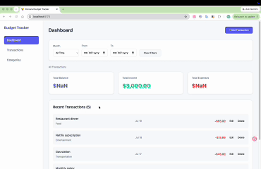
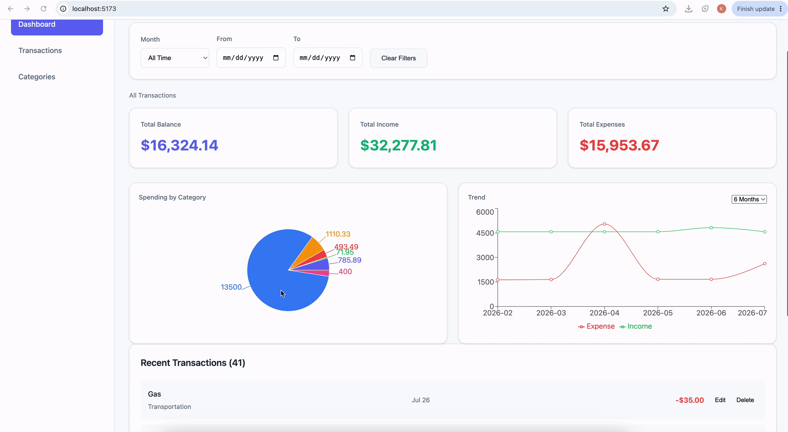
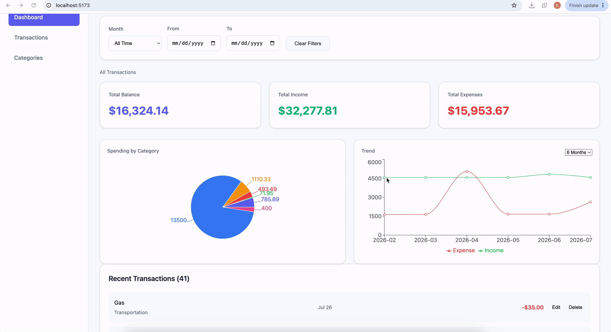
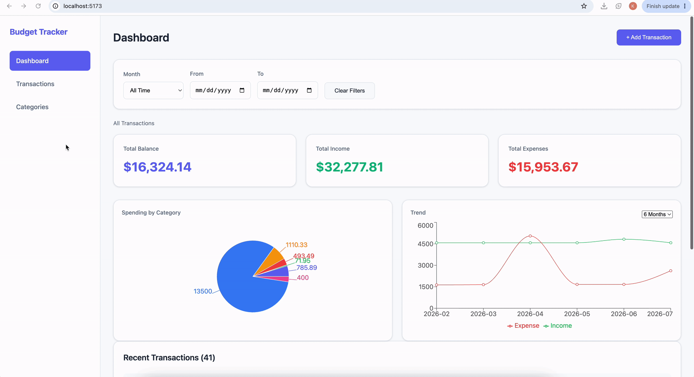
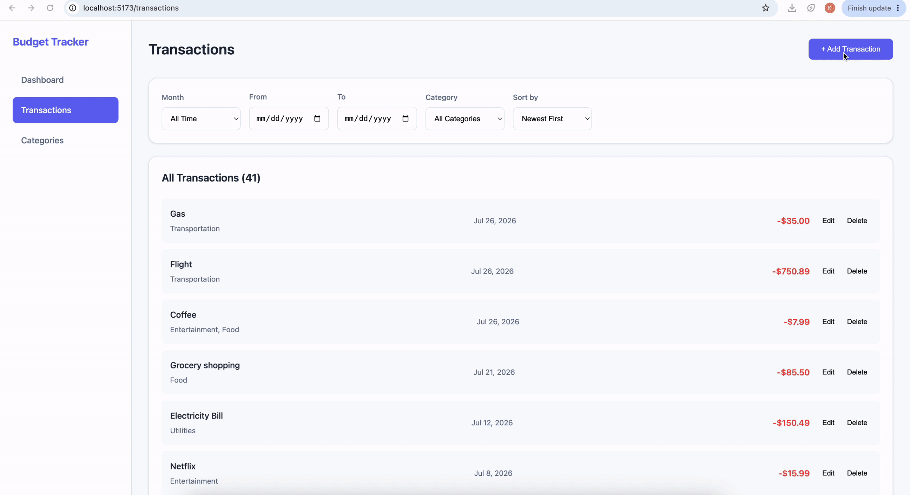
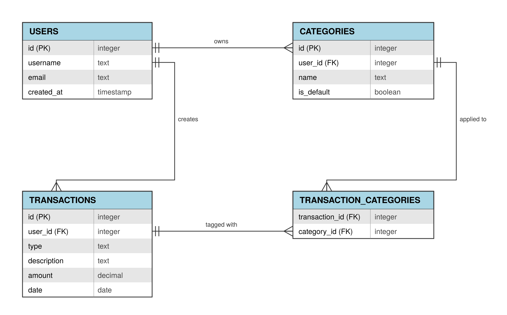

# WalletWatch

CodePath WEB103 Final Project

Designed and developed by: Mario Trevino, Faisal Rasheed Khan, Ke Zhang, Eric Chen, Klane Fondo, Kubra Sag

🔗 Link to deployed app: https://walletwatch-fsgt.onrender.com

### Description and Purpose
Most students get their money at the start of the month, and by the middle, they have no idea where it all went. WalletWatch is here to fix that.

WalletWatch is a simple budget tracker. You add a transaction in a few seconds, tag it with a category, and right away you can see where your money is going. The app aims to make everyday budgeting easy, not stressful.

### Inspiration
Many budgeting tools are either too complex or too rigid. We wanted to build something lightweight that lets users log transactions quickly and organize them in a way that makes sense to them, without a steep learning curve. One transaction can have more than one category — a dinner with a client could be tagged as both Food and Business — giving a more accurate picture of spending.

## Tech Stack

Frontend: React

Backend: Node.js, Express

## Features

- [x] ✅ **View Transactions** — Users can view a list of all their income and expense transactions.     
  

- [x] ✅ **Add Transaction** — Users can add a new transaction with an amount, description, date, and category.
  

- [x] ✅ **Edit Transaction** — Users can update an existing transaction's details.
  

- [x] ✅ **Delete Transaction** — Users can remove a transaction they no longer want tracked.
  

- [x] ✅ **Category Tagging** — Transactions can be tagged with one or more categories (e.g. Food, Transportation, Business) via a many-to-many relationship.
  

- [x] ✅ **Create/Delete Category** — Users can create a new custom category and delete a category they no longer need.
  

- [x] ✅ **Spending by Category Chart** — A pie chart breaks down expenses by category so users can see where their money goes.
  

- [x] ✅ **Income/Expense Trend Chart** — A line chart shows income and expense trends over time.
  

- [x] ✅ **Auto-Generated Default Categories** — When a new user is created, a default set of categories is automatically generated for them.
  

- [x] ✅ **Add/Edit Transaction Modal** — A modal lets users quickly add or edit a transaction without leaving the dashboard.
  

- [x] ✅ **Transaction Validation** — The app validates that a transaction has a positive amount, a selected category, and a date that isn't in the future before saving.
  

- [x] ✅ **Filter/Sort Transactions** — Users can filter transactions by category or date range, and sort by amount or recency.
  
      
- [x] ✅ **Recurring Transactions** — Users can mark a transaction as repeating monthly so it's automatically tracked each month.
  

## Database Design

We have four tables: Users, Transactions, Categories, and Transaction_Categories that connects Transactions and Categories. This is what lets one transaction have several categories, and one category show up on many transactions.

## Installation Instructions

[instructions go here]
