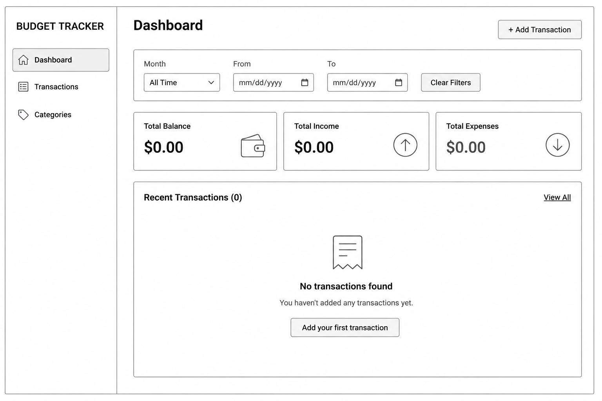
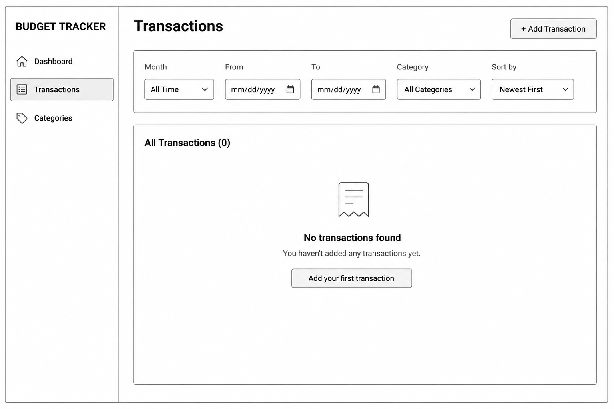
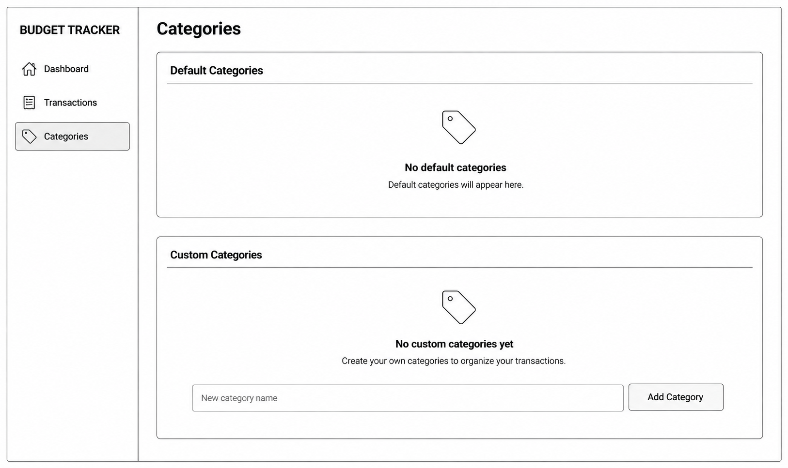
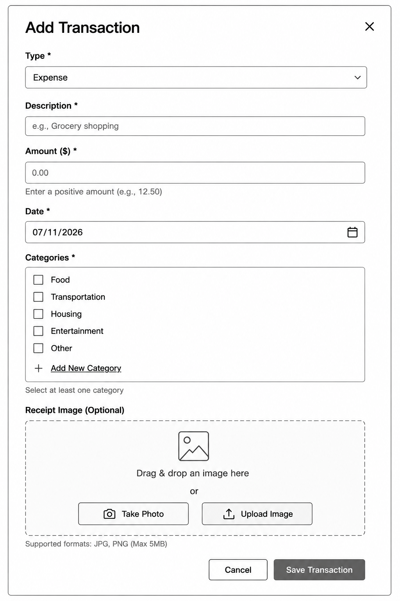

# Wireframes

Reference the Creating an Entity Relationship Diagram final project guide in the course portal for more information about how to complete this deliverable.

## List of Pages

[👉🏾👉🏾👉🏾 List the pages you expect to have in your app, with a ⭐ next to pages you have wireframed]

⭐ Dashboard

⭐ Transactions

⭐ Categories

⭐ Add Transaction Modal

## Wireframe 1: Dashboard

[👉🏾👉🏾👉🏾 include wireframe 1]
The Dashboard gives users an overview of their financial activity, including balance, income, expenses, and recent transactions.

## Wireframe 2: Transactions

[👉🏾👉🏾👉🏾 include wireframe 2]
The Transactions page allows users to browse, filter, sort, and manage all transactions.

## Wireframe 3: Categories

[👉🏾👉🏾👉🏾 include wireframe 3]

The Categories page allows users to manage default and custom categories.

## Wireframe 4: Add Transaction Modal

[👉🏾👉🏾👉🏾 include wireframe 3]

The Add Transaction modal lets users create a new transaction without leaving the current page.

